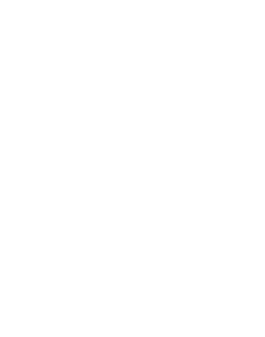
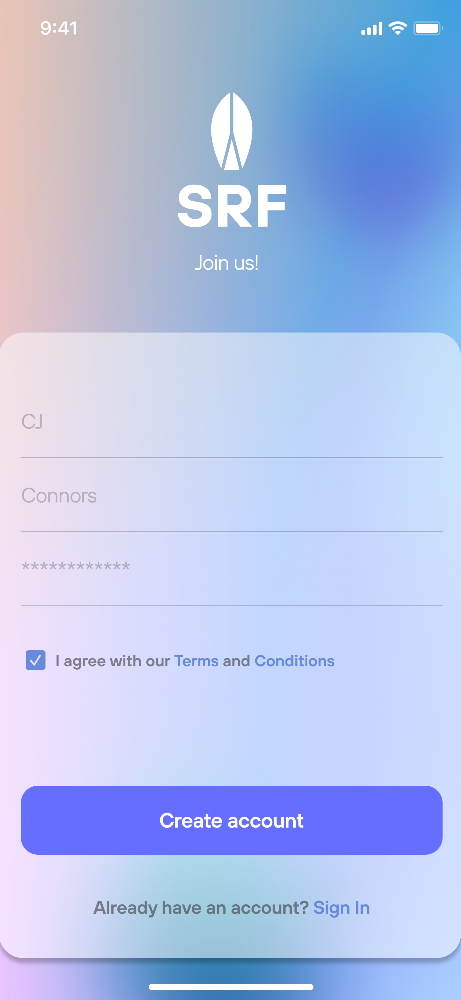
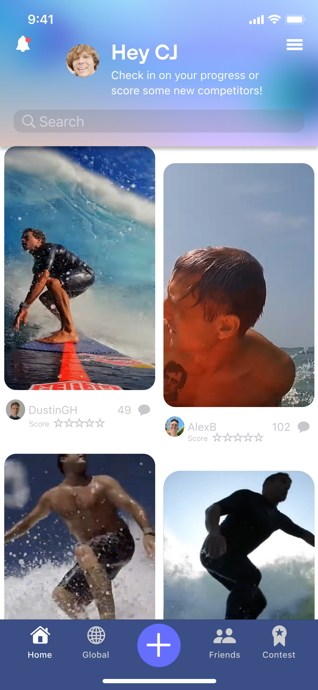
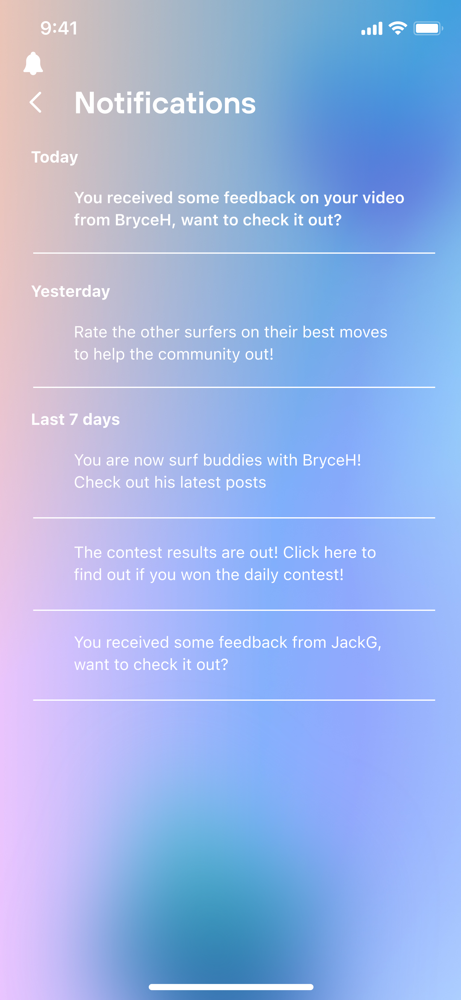
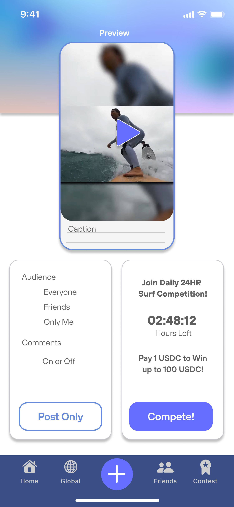
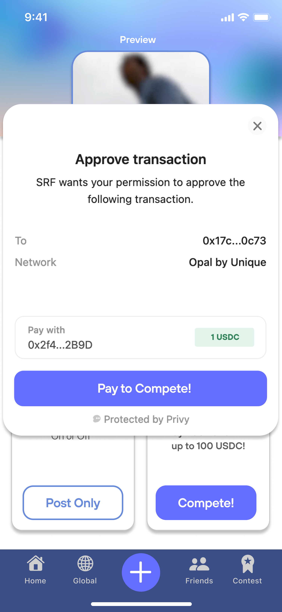
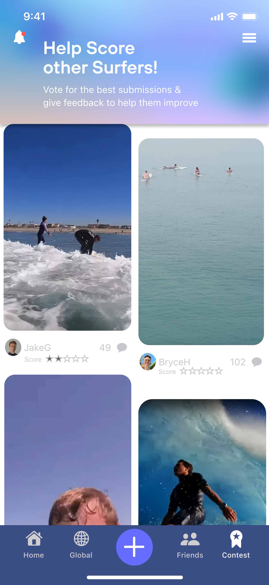
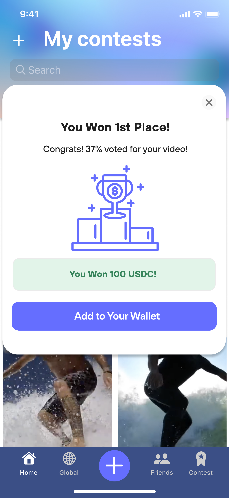
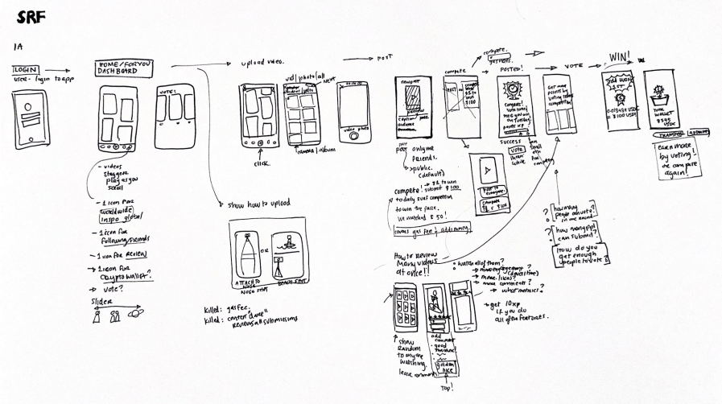

 
    
 

    
        
        
        
    

---

### What is SRF?
SRF is an interaatcive surfing application designed to bring the surfing community together. It encourages users to submit videos of themselves surfing and empowers them to interact by voting in competitions. 

### Features
- **Parachain:** 

### Demo
- [Demo](https://youtu.be/rZFbwazISlo) (28 Jul 2024)

### Images

 
    
    
    
    
    
    
    
    
    
    
 

### Roadmap

 
    
 

### Attribution & Research

## Contributing & License
Help us build Melodot! Melodot is an open-source software licensed under the [MIT License](https://github.com/jjjutla/melodot/blob/main/MIT-LICENSE.txt).
