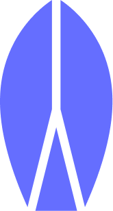
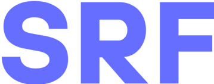

 
    
 
 
    
 

    
        
        
        
    

---

### What is SRF?
SRF is an interactive surfing application designed to bring the surfing community together. It encourages users to submit videos of themselves surfing and empowers them to interact by voting in competitions. 

- [Explainer video](https://share.descript.com/view/dM8EP4Tx86G)

### Features
- **Parachain:** Used UniqueNetwork ParaCahin
- **PolkadotJS API:** Is used to connect the front end to the Parachain
- **Log In using NFT:** Mint NFT whenever someone logs in using UniqueNetworks' Parachain
- **Tokenize video submissions:** Mint NFT whenever someone uploads a video and enters the contest
- **Distribute rewards:** Distribute USDC on Polkadot to the uploader and athlete
- **What's Next?**

### Demo
- [App demo](https://youtu.be/rZFbwazISlo)

### Images

 
    
    
    
    
    
    
    
    
    
    
 

### Roadmap

 
    
 

 
    
 

    
        
        
        
    

## Contributing & License
Help us build SRF! SRF is an open-source software licensed under the [MIT License](https://github.com/jjjutla/melodot/blob/main/MIT-LICENSE.txt).
